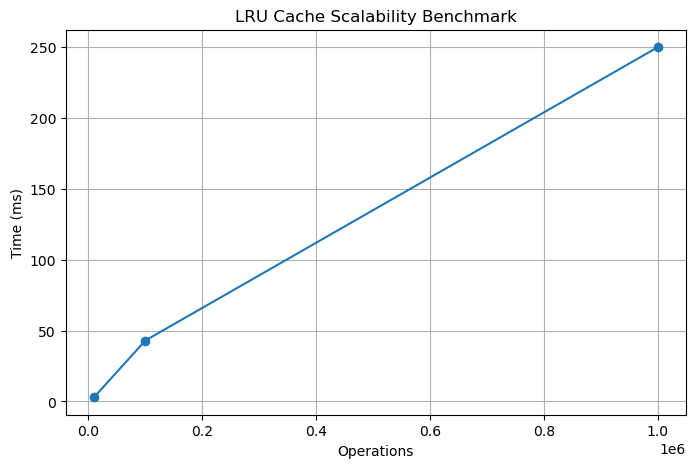
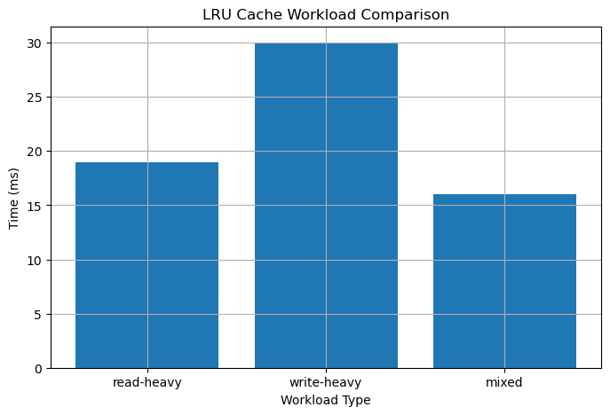

# LRU Cache REST API

A high-performance, thread-safe LRU (Least Recently Used) Cache implemented in C++ and exposed through a FastAPI REST interface.

🔗 Repository: https://github.com/kanishk123agarwal/LRU-Cache-Rest-Api

---

## Features

✅ O(1) Get Operation

✅ O(1) Put Operation

✅ O(1) LRU Eviction

✅ HashMap + Doubly Linked List Design

✅ Thread-Safe Implementation

✅ FastAPI REST Interface

✅ Concurrent Access Support

✅ Benchmarking Suite

✅ Performance Visualization

---

## Project Overview

Caching is one of the most important techniques used to improve application performance by storing frequently accessed data in memory.

This project implements a thread-safe LRU Cache from scratch using C++ and exposes cache operations through REST APIs using FastAPI.

The cache maintains constant-time complexity for insertion, lookup, update, and eviction operations.

The project also includes:

* REST APIs
* Concurrent access support
* Benchmarking suite
* Workload analysis
* Performance visualization

---

## Problem Statement

Many real-world systems repeatedly access a small subset of recently used data.

Examples include:

* Database query results
* Browser history
* CDN content caching
* API response caching
* Operating system page replacement

Since memory is limited, cached items must be removed when the cache becomes full.

The Least Recently Used (LRU) policy removes the item that has not been accessed for the longest time, ensuring that recently used data remains available.

---

## Why LRU Cache?

An efficient cache should support:

* Fast lookup
* Fast insertion
* Fast deletion
* Efficient eviction

Using only arrays or linked lists would require O(n) operations.

To achieve O(1) complexity, this implementation combines:

* HashMap
* Doubly Linked List

This is the standard design used in production-grade LRU cache implementations.

---

## Architecture

```text
┌─────────┐
│ Client  │
└────┬────┘
     │
     ▼
┌─────────┐
│ FastAPI │
└────┬────┘
     │
     ▼
┌──────────────────┐
│ Thread-Safe LRU  │
│      Cache       │
└────┬────────┬────┘
     │        │
     ▼        ▼

┌─────────┐  ┌─────────────┐
│ HashMap │  │ Doubly      │
│ key→ptr │  │ Linked List │
└─────────┘  └─────────────┘
```

---

## Project Structure

```text
LRU-Cache-Rest-Api/
│
├── src/
│   ├── LRUCache.h
│   ├── LRUCache.cpp
│   └── main.cpp
│
├── api.py
│
├── tests/
│   ├── functional_test.cpp
│   ├── benchmark.cpp
│   ├── workload_benchmark.cpp
│   └── concurrent_test.cpp
│
├── graphs/
│   ├── benchmark_graph.py
│   └── workload_graph.py
│
├── report/
│   ├── operations_vs_time.png
│   └── workload_comparison.png
│
├── docs/
│   └── architecture.md
│
├── README.md
├── requirements.txt
└── .gitignore
```

---

## Data Structures Used

### 1. HashMap

```cpp
unordered_map<int, Node*>
```

Purpose:

* O(1) key lookup
* Direct access to cache nodes

---

### 2. Doubly Linked List

Maintains access order.

Most Recently Used:

```text
HEAD
```

Least Recently Used:

```text
TAIL
```

Operations:

* Insert Front
* Remove Node
* Move To Front
* Remove Tail

All operations execute in O(1).

---

## Cache Operations

### PUT

Insert or update a key-value pair.

If the cache reaches capacity:

* Remove the least recently used item
* Insert the new item

Complexity:

```text
O(1)
```

---

### GET

Retrieve value associated with a key.

If found:

* Return value
* Move node to front

Complexity:

```text
O(1)
```

---

### EVICTION

Remove least recently used item from cache.

Complexity:

```text
O(1)
```

---

## Thread Safety

The cache supports concurrent requests.

Synchronization is implemented using:

```cpp
std::mutex
```

Protected operations:

* put()
* get()
* eviction logic
* cache statistics updates

This prevents race conditions and ensures consistency under concurrent access.

---

## REST API Endpoints

### PUT /put

Insert or update a key-value pair.

Request:

```json
{
    "key": 1,
    "value": 100
}
```

Response:

```json
{
    "status": "success"
}
```

---

### GET /get/{key}

Example:

```http
GET /get/1
```

Response:

```json
{
    "value": 100
}
```

---

### GET /stats

Response:

```json
{
    "hits": 15,
    "misses": 3,
    "capacity": 5,
    "current_size": 4
}
```

---

## Time Complexity

| Operation | Complexity |
| --------- | ---------- |
| Get       | O(1)       |
| Put       | O(1)       |
| Delete    | O(1)       |
| Evict     | O(1)       |

---

## Benchmark Results

Benchmarking was performed using:

* Sequential workloads
* Mixed workloads
* Concurrent workloads

### Operations vs Time



### Workload Comparison



Example:

| Operations   | Time (ms) |
| ------------ | --------- |
| 10,000       | 3         |
| 1,00,000     | 43        |
| 10,00,000    | 250       |

---

## Building the Project

### Clone Repository

```bash
git clone https://github.com/kanishk123agarwal/LRU-Cache-Rest-Api.git
cd LRU-Cache-Rest-Api
```

---

### Compile C++ Cache

```bash
g++ src/main.cpp src/LRUCache.cpp -o cache
```

---

### Run FastAPI

```bash
uvicorn api.app:app --reload
```

Server:

```text
http://127.0.0.1:8000
```

Swagger Documentation:

```text
http://127.0.0.1:8000/docs
```

---

### Run Functional Tests

```bash
g++ tests/functional_test.cpp -o functional_test
./functional_test
```

---

### Run Benchmarks

```bash
g++ tests/benchmark.cpp -o benchmark
./benchmark
```

---

### Run Concurrent Tests

```bash
g++ tests/concurrent_test.cpp -pthread -o concurrent_test
./concurrent_test
```

---

## Design Decisions

### Why HashMap + Doubly Linked List?

HashMap provides:

* O(1) lookup

Doubly Linked List provides:

* O(1) insertion
* O(1) deletion
* O(1) move-to-front operation

Combining both structures allows all cache operations to run in constant time.

---

### Why Not Use a Queue?

A queue cannot efficiently:

* Remove arbitrary nodes
* Move recently accessed items to the front

Those operations would require O(n) traversal.

---

## Challenges Faced

One of the biggest challenges was maintaining consistency between:

* HashMap entries
* Doubly Linked List nodes

while simultaneously ensuring thread safety during concurrent cache operations.

---

## Future Improvements

* Reader-Writer Locks
* TTL (Time-To-Live) Expiration
* Persistent Storage Support
* Distributed Cache Architecture
* Cache Sharding
* Docker Containerization

---

## Key Learnings

This project demonstrates:

* Data Structures
* Object-Oriented Design
* Concurrency
* REST API Development
* Benchmarking
* System Design Fundamentals

---

## Author

Kanishk Agarwal

M.Tech CSE

National Institute of Technology (NIT)
